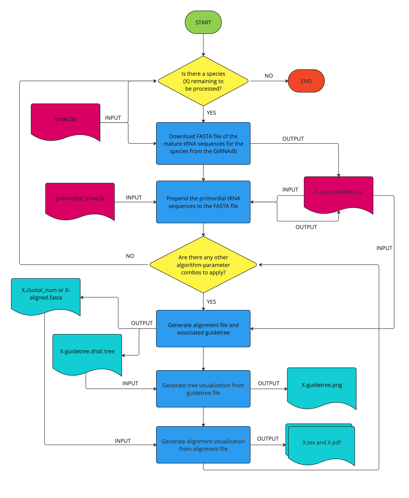
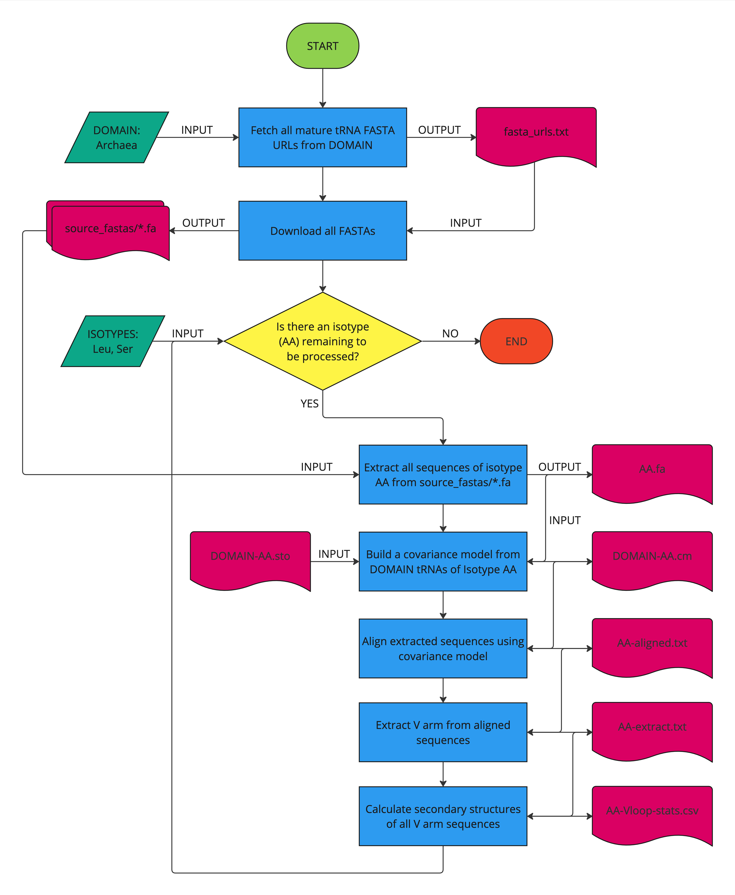

# tRNA

* [Proposal](proposal.md)
* [Plan](plan.md)
* [Overview of Results from Phase 1](docs/overview.md)
* [Latest Release](https://github.com/ds5500/project-Samee-Mushtak-25/releases/tag/v0.1)
  * Download bulk_output.zip from the above link to see the output of the current tRNA processing pipeline if unable to run the script.  

## Public-facing site

[https://samee-mushtak.observablehq.cloud/trna-alignment/](https://samee-mushtak.observablehq.cloud/trna-alignment/)

We are using the above site in place of the docs folder of our repository.

## Conda Setup

Running the code in this project requires **Make** and **Bioconda**.

To install Make in your conda environment:

```
conda install make
```

To configure your conda to use the Bioconda channel: (see also the [Bioconda documentation](https://bioconda.github.io/index.html))

```
conda config --add channels bioconda
conda config --add channels conda-forge
conda config --set channel_priority strict
```

While in this directory, run the following conda commands to create the required conda environment (see [Comments on Reproducibility](#comments-on-reproducibility)):

```
conda create -n trna python=3.12
conda install bioconda::bowtie2
conda install bioconda::bwa
conda install -c conda-forge ete3
conda install bioconda::fasttree
conda install conda-forge::tectonic
```

## Docker Setup

In order to run process_trnas.sh (`make bulk_process`), the following Docker images will need to be installed.

```
docker pull biocontainers/clustal-omega:v1.2.1_cv5
```

```
docker pull biocontainers/mafft:v7.407-2-deb_cv1
```

```
docker pull biocontainers/t-coffee:v12.00.7fb08c2-4-deb_cv1
```

Docker Desktop must be running in the background for process_trnas.sh to work (see [Docker's instructions](https://docs.docker.com/engine/install/) on installing Docker Desktop).

## EDA

To run the EDA for BWA:

```
make eda_bwa
```

To run the EDA for Bowtie 2:

```
make eda_bowtie2
```

To clean the output from the EDA:

```
make clean_eda
```

Because BWA and Bowtie 2 have different formats for FASTA indexing, the `make clean_eda` command should be run in between different EDAs.

See [plan.md](plan.md) for a discussion of the results of this EDA. We have not yet implemented visualizations of alignments, so we display our results in a textual format instead of with figures.

## Process tRNA

To run bulk process script:

```
make bulk_process
```

To clean the output from the bulk process script:

```
make clean_bulk
```

### Flowchart of bulk processing



_Flowchart made with Miro_

## MetAl Scoring

To create alignment quality reports using MetAl metrics:

```
make metal_reports
```

To run this command, you must download and build Benjamin Blackburne's MetAl program from source: [https://github.com/benb/MetAl](https://github.com/benb/MetAl)

TODO: Detailed instructions on building from source

## V Loop Analysis

To run V loop analysis script:

```
make trna_leu_analysis
```

To clean the output from the bulk process script:

```
make clean_leu
```

### Flowchart



_Flowchart made with Miro_

## Comments on Reproducibility

* Because Bioconda recommends setting conda's channel priority to strict, creating the required conda environment directly from the environment.yml file cannot be done reliably.
* Currently process_trnas.sh contains some commands that are specific to the OS X shell (notably, `sed` with the -E flag). We have plans to port this shell script to a Python script in order to improve cross-platform reproducibility.

## Attribution

* Primary Stakeholder: [Dr. Jennifer Spillane](https://roux.northeastern.edu/people/jennifer-spillane/)
* Additional Stakeholders: [Dr. Zachary Burton](https://www.canr.msu.edu/people/burton_zachary), [Dr. Lei Lei](https://www.une.edu/people/lei-lei)

### Algorithms

*  Bowtie 1.3.1
    * Langmead B, Trapnell C, Pop M, Salzberg SL. [Ultrafast and memory-efficient alignment of short DNA sequences to the human genome. Genome Biol](http://genomebiology.com/2009/10/3/R25) 10:R25.
* BWA-MEM
    * Unpublished. See [man bwa](https://bio-bwa.sourceforge.net/bwa.shtml).
* Clustal Omega
    * Sievers F, Wilm A, Dineen DG, Gibson TJ, Karplus K, Li W, Lopez R, McWilliam H, Remmert M, Söding J, Thompson JD, Higgins DG (2011). [Fast, scalable generation of high-quality protein multiple sequence alignments using Clustal Omega.](https://www.nature.com/msb/journal/v7/n1/full/msb201175.html) Molecular Systems Biology 7:539 doi:10.1038/msb.2011.75
    * Sievers F, Higgins DG (2018) [Clustal Omega for making accurate alignments of many protein sequences.](https://onlinelibrary.wiley.com/doi/full/10.1002/pro.3290) Protein Sci 27:135-145
    * Sievers F, Barton GJ, Higgins DG (2020) [Multiple Sequence Alignment.](https://www.wiley.com/en-us/Bioinformatics%2C+4th+Edition-p-9781119335580) Bioinformatics 227, pp 227-250, AD Baxevanis, GD Bader, DS Wishart (Eds)
* ETE 3
    * Reconstruction, analysis and visualization of phylogenomic data. Jaime Huerta-Cepas, Francois Serra and Peer Bork. Mol Biol Evol 2016; [doi: 10.1093/molbev/msw046](http://mbe.oxfordjournals.org/content/early/2016/03/21/molbev.msw046).
* FastTree
    * Price, M.N., Dehal, P.S., and Arkin, A.P. (2009) FastTree: Computing Large Minimum-Evolution Trees with Profiles instead of a Distance Matrix. Molecular Biology and Evolution 26:1641-1650, doi:10.1093/molbev/msp077.
    * Price, M.N., Dehal, P.S., and Arkin, A.P. (2010) FastTree 2 -- Approximately Maximum-Likelihood Trees for Large Alignments. PLoS ONE, 5(3):e9490. doi:10.1371/journal.pone.0009490.
* Infernal
    *  E. P. Nawrocki and S. R. Eddy, [Infernal 1.1: 100-fold faster RNA homology searches](https://academic.oup.com/bioinformatics/article/29/22/2933/316439?login=false), Bioinformatics 29:2933-2935 (2013).
* MAFFT
    * Katoh, Rozewicki, Yamada 2019 ([Briefings in Bioinformatics 20:1160-1166](https://academic.oup.com/bib/article/20/4/1160/4106928)) MAFFT online service: multiple sequence alignment, interactive sequence choice and visualization
    * Kuraku, Zmasek, Nishimura, Katoh 2013 ([Nucleic Acids Research 41:W22-W28](https://academic.oup.com/nar/article/41/W1/W22/1099639)) aLeaves facilitates on-demand exploration of metazoan gene family trees on MAFFT sequence alignment server with enhanced interactivity
* MetAl
    * Benjamin P. Blackburne, Simon Whelan, Measuring the distance between multiple sequence alignments, Bioinformatics, Volume 28, Issue 4, February 2012, Pages 495–502, https://doi.org/10.1093/bioinformatics/btr701
* MUSCLE
    * [Edgar, Robert C. (2004), MUSCLE: multiple sequence alignment with high accuracy and high throughput, Nucleic Acids Research 32(5), 1792-97.](http://nar.oupjournals.org/cgi/content/full/32/5/1792?ijkey=48Nmt1tta0fMg&keytype=ref)
* T-Coffee
    * [T-Coffee: A novel method for multiple sequence alignments](https://pubmed.ncbi.nlm.nih.gov/10964570/) _Notredame, Higgins, Heringa, JMB, 302 (205-217) 2000_ 
* Tectonic
    * [The Tectonic Project](https://tectonic-typesetting.github.io/en-US/index.html).
* WebLogo
    * Crooks GE, Hon G, Chandonia JM, Brenner SE WebLogo: A sequence logo generator, Genome Research, 14:1188-1190, (2004) https://weblogo.berkeley.edu/Crooks-2004-GR-WebLogo.pdf
    * Schneider TD, Stephens RM. 1990. [Sequence Logos: A New Way to Display Consensus Sequences.](http://www.lecb.ncifcrf.gov/~toms/paper/logopaper/) Nucleic Acids Res. 18:6097-6100 
 
### Other References

1. Chan, P.P. & Lowe, T.M. (2016) [GtRNAdb 2.0: an expanded database of transfer RNA genes identified in complete and draft genomes.](https://academic.oup.com/nar/article/44/D1/D184/2503100) Nucl. Acids Res. 44(Database issue):D184-D189.
2. Chan, P.P. & Lowe, T.M. (2009) [GtRNAdb: A database of transfer RNA genes detected in genomic sequence.](https://academic.oup.com/nar/article/37/suppl_1/D93/1010599?) Nucl. Acids Res. 37(Database issue):D93-D97.
3. da Veiga Leprevost F, Grüning BA, Alves Aflitos S, Röst HL, Uszkoreit J, Barsnes H, Vaudel M, Moreno P, Gatto L, Weber J, Bai M, Jimenez RC, Sachsenberg T, Pfeuffer J, Vera Alvarez R, Griss J, Nesvizhskii AI, Perez-Riverol Y. Bioinformatics. 2017 Aug 15;33(16):2580-2582. doi: 10.1093/bioinformatics/btx192. [BioContainers: an open-source and community-driven framework for software standardization.](https://academic.oup.com/bioinformatics/article/33/16/2580/3096437)
4. Grüning, Björn, Ryan Dale, Andreas Sjödin, Brad A. Chapman, Jillian Rowe, Christopher H. Tomkins-Tinch, Renan Valieris, the Bioconda Team, and Johannes Köster. 2018. Bioconda: Sustainable and Comprehensive Software Distribution for the Life Sciences. Nature Methods, 2018 doi:10.1038/s41592-018-0046-7.
5. Lei L, Burton ZF. The 3 31 Nucleotide Minihelix tRNA Evolution Theorem and the Origin of Life. Life. 2023; 13(11):2224. https://doi.org/10.3390/life13112224
6. Lei, L., & Burton, Z. F. (2024). Origin of Type II tRNA Variable Loops, Aminoacyl-tRNA Synthetase Allostery from Distal Determinants, and Diversification of Life. DNA, 4(3), 252-275. https://doi.org/10.3390/dna4030017 
